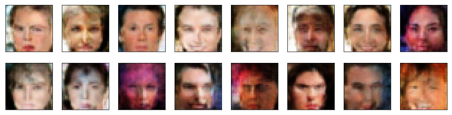

# udacity-deep-learning-project-4-generating-faces
In this project, I demonstrate how DCGAN (Deep Convolutional Generative Adversarial Network) can generate new set of images that is as realistic as possible on [CelebFaces dataset](http://mmlab.ie.cuhk.edu.hk/projects/CelebA.html)

  

After some training, my network could get a generator that can generate celebrities faces that look like these

  

## Prerequisites
- Download the data from [here](https://s3.amazonaws.com/video.udacity-data.com/topher/2018/November/5be7eb6f_processed-celeba-small/processed-celeba-small.zip) to work locally
- Numpy v1.19
- PyTorch v1.6.0
- CUDA 10.2 (optional for GPU training)
